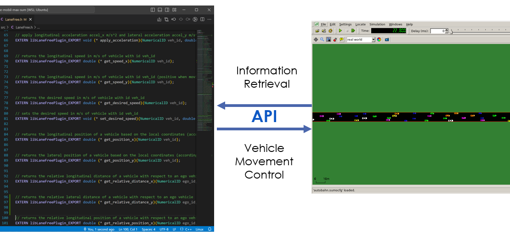
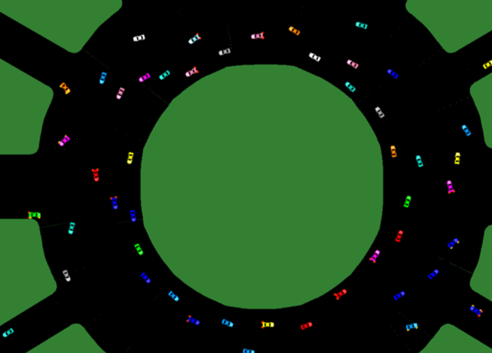

<a href="https://www.trafficfluid.tuc.gr/en/home">

</a>

TrafficFluid-Sim
================

[TrafficFluid-Sim](https://www.trafficfluid.tuc.gr/en/home) is an open source, microscopic simulation tool for lane-free traffic environments in the era of Connected and Automated Vehicles.
The project is a fork of [Eclipse SUMO - Simulation of Urban MObility](https://github.com/eclipse-sumo/sumo) that explicitly targets the lane-free traffic paradigm.

Highlighted Features:
* Design from scratch and test lane-free vehicle movement strategies in C/C++, with an API that provides information about the traffic environment, 
effectively emulating vehicle-to-vehicle and vehicle-to-infrastructure communication.

* Each API function call in the code is accompanied with a concise description of its usage and functionality.

* The underlying movement dynamics of vehicles can be either the double integrator model for both the longitudinal (x) and lateral (y) axis, 
or a bicycle model that better captures the orientation of the vehicles as well.
* A variety of common traffic environments can be designed and simulated, such as: highways, custom on-ramp and off-ramp scenarios, 
bidirectional scenarios that can be also tied with emergent infrastructure-based applications such as Internal Boundary Control, roundabouts, intersections, and ring-roads.

  
   
  

   
  
  
  

TrafficFluid-Sim was developed within the frame of the
research project [TrafficFluid](https://www.trafficfluid.tuc.gr/en/home), an ERC
Advanced Grant hosted at the [Technical University of Crete](https://www.tuc.gr).

Build and Installation
----------------------

You can download pre-compiled versions of TrafficFluid-Sim for both Windows 10/11 and Ubuntu 22.04 LTS 
via our [downloads site](https://www.trafficfluid.tuc.gr/en/home).

If you want to work with the source code for custom enhancements under Windows environments, as prerequisite for SUMO, please 
consult our [user manual](https://www.trafficfluid.tuc.gr/en/home) (Section 1.3) and make sure all suggested libraries are installed under the correct versions.

Getting started
---------------

To get started with TrafficFluid-Sim, we provide a complete [user manual](https://www.trafficfluid.tuc.gr/en/home), including technical information, 
installation and setup instructions, design guidelines for lane-free traffic scenarios and vehicle movement strategies and more.

Additionally, since this work is an extension of SUMO, we encourage consulting the official [SUMO documentation](https://sumo.dlr.de/docs) for basic features of the simulator.

License
-------
TrafficFluid-Sim can be used for research purposes. 
This codebase is a fork of SUMO, which is licensed under the [Eclipse Public License Version 2](https://eclipse.org/legal/epl-v20.html).
The licenses of the different libraries and supplementary code information are in the
subdirectories and in the [Documentation](https://sumo.dlr.de/docs/Libraries_Licenses.html).

Citation
--------
If TrafficFluid-Sim is used for 
